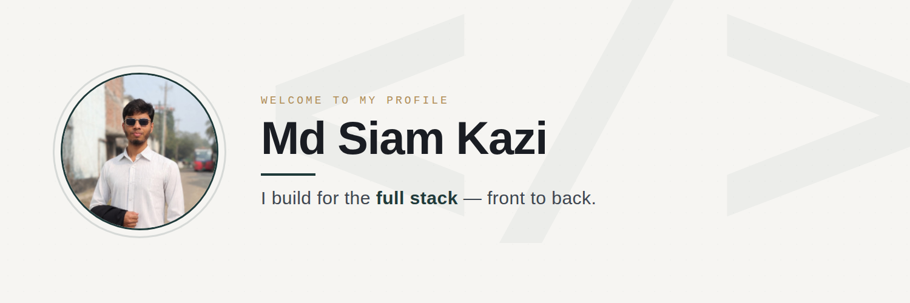

# Md Siam Kazi
### Full Stack Developer

📍 Chadpur &nbsp;•&nbsp; 📧 [itzsksiam@gmail.com](mailto:itzsksiam@gmail.com) &nbsp;•&nbsp; 📱 01312852317

---

## 👋 About Me

I'm a full-stack developer who builds web applications with Next.js, React, Node.js, Express, and MongoDB. I enjoy turning ideas into real, working products — from ticket booking platforms to SaaS tools. Right now I'm deepening my backend architecture and system design skills while chasing better, more scalable ways to build.

## 🔭 Current Activities

- 🚀 Building a full-stack **ticket booking platform**
- 💡 Exploring and validating **SaaS product ideas**
- 📘 Learning **Advanced JavaScript, TypeScript & Next.js**
- 🧠 Practicing **Data Structures, Algorithms & competitive programming**
- 🤝 Open to collaborating on open-source and web app projects

## 🛠️ Skills

**Languages**

   

**Frontend**

     

**Backend**

   

**Database**

   

**DevOps & Hosting**

   

**Testing & Tools**

 

## 🌐 Socials

  

## 📊 GitHub Stats

 
 

---

